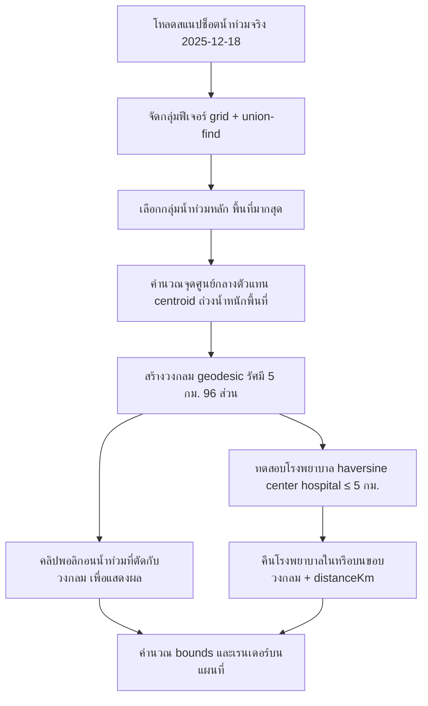

# การวิเคราะห์ "โรงพยาบาลภายในรัศมี 5 กม. จากพื้นที่น้ำท่วม"

เอกสารนี้อธิบาย **การคำนวณจริง** ที่โค้ดปัจจุบันใช้ (สาขา
`feature/real-flood-hospital-buffer`) ไม่ใช่คำอธิบาย GIS แบบทั่วไป
เขียนขึ้นเพื่อให้ดีไซเนอร์ นักพัฒนา ผู้นำเสนอ และผู้ฟังเชิงเทคนิค
เข้าใจและตอบคำถามได้ว่า "ผลลัพธ์ถูกคำนวณมาอย่างไร"

> อ้างอิงโค้ดหลัก: `src/lib/flood-radius-analysis.ts`,
> `src/lib/flood-proximity.ts`, `src/app/api/flood-buffer/route.ts`,
> `src/sections/morphism/view/morphism-view.tsx`

---

## Purpose — ความหมายของคำถาม

คำถาม **"โรงพยาบาลภายในรัศมี 5 กม. จากพื้นที่น้ำท่วม"**
ในเดโมนี้ **ไม่ได้** หมายถึงการสร้าง buffer เชิงสัณฐาน (morphological buffer)
รอบ *ทุก* ขอบพอลิกอนน้ำท่วมแล้วหาโรงพยาบาลที่ตกในแถบนั้น

สิ่งที่เดโมทำจริงคือ **แบบจำลองรัศมีวงกลม (circular analysis-radius model)**:

1. เลือก **กลุ่มพื้นที่น้ำท่วมหลัก (flood cluster)** จากสแนปช็อตจริง
2. คำนวณ **จุดศูนย์กลางวิเคราะห์ (analysis center)** หนึ่งจุด เป็นตัวแทนของกลุ่มนั้น
3. สร้าง **วงกลม geodesic รัศมี 5 กม.** รอบจุดศูนย์กลางนั้น
4. นับเฉพาะโรงพยาบาลที่อยู่ **ภายในวงกลมเดียวกัน**

กล่าวคือ ระยะทางถูกวัดจาก **จุดศูนย์กลางกลุ่มน้ำท่วม** ไม่ใช่จากขอบพอลิกอนน้ำท่วมแต่ละชิ้น
วงกลมที่แสดงบนแผนที่คือ *ขอบเขตการวิเคราะห์* และเป็นเรขาคณิตชุดเดียวกับที่ใช้กรองโรงพยาบาล

> ⚠️ **อย่าอธิบายผิด** ว่าเป็น "buffer 5 กม. รอบทุกพอลิกอนน้ำท่วม" — ดูหัวข้อ
> [ความต่างระหว่างวงกลมวิเคราะห์กับ polygon buffer](#difference--ความต่างระหว่างวงกลมวิเคราะห์กับ-polygon-buffer)

---

## Input data — ข้อมูลนำเข้า

| รายการ | ค่าจริงในเดโม |
| --- | --- |
| วันที่สแนปช็อตน้ำท่วม | **18 ธันวาคม 2025** (`2025-12-18`) |
| แหล่งเรขาคณิตน้ำท่วม | สแนปช็อต SAR จริง (GISTDA/Vallaris) — ไฟล์ acquisition `S1A_20251218_0603, S1A_20251218_1829` เก็บเป็น `detail.json.gz` (พอลิกอน/มัลติพอลิกอน) |
| ชุดข้อมูลจุดโรงพยาบาล | `public/data/hospitals.geojson` — จุดโรงพยาบาลรัฐจริง (10k+ จุดทั่วประเทศ) |
| ระบบพิกัด | ลองจิจูด/ละติจูด (องศา, ลำดับ GeoJSON `[lng, lat]`) ไม่มีการ project ลงระนาบ ระยะทางคำนวณบนทรงกลม |
| รัศมี | **5 กิโลเมตร** (`FLOOD_PROXIMITY_RADIUS_KM = 5`) |
| ที่มาของจุดศูนย์กลาง | centroid ถ่วงน้ำหนักด้วยพื้นที่ของกลุ่มน้ำท่วมหลัก (snap ไปยังสมาชิกที่ใหญ่สุดหากเลื่อนหลุดกลุ่ม) |
| ประมวลผลฝั่ง server / preprocessing | จัดกลุ่ม → หาจุดศูนย์กลาง → สร้างวงกลม → คลิปพอลิกอนน้ำท่วม → ทดสอบโรงพยาบาล → คำนวณ bounds |
| ประมวลผลฝั่ง browser | เรนเดอร์วงกลม + จุดศูนย์กลาง + พอลิกอนน้ำท่วมที่คลิปแล้ว + จุดโรงพยาบาลที่ตรงเงื่อนไข และเลื่อนกล้องให้พอดี bounds |

การวิเคราะห์ทั้งหมด (ระยะทาง, การกรอง) รันที่ **`/api/flood-buffer`** บนเซิร์ฟเวอร์
หรือถูก precompute ไว้ล่วงหน้าเป็น asset `flood/2025-12-18/analysis-5km.json.gz`
โดย pipeline `bun run build:flood` — เบราว์เซอร์ **ไม่เคย** ดาวน์โหลดหรือประมวลผล
GeoJSON น้ำท่วมดิบทั้งชุด มันได้รับเฉพาะผลลัพธ์ที่คลิป/กรองแล้วเท่านั้น

> 🔒 เอกสารนี้ไม่เปิดเผย API key, credential หรือ URL ส่วนตัวใด ๆ — ทั้งหมดอยู่ใน
> `.env.local` (ไม่คอมมิต) และเข้าถึงผ่าน `configs/endpoint.ts` เท่านั้น

---

## Calculation pipeline — ลำดับการคำนวณจริง

ลำดับด้านล่างตรงกับฟังก์ชัน `analyzeFloodRadius()` ใน
`src/lib/flood-radius-analysis.ts` และการเรนเดอร์ใน `morphism-view.tsx`

1. **โหลดชุดข้อมูลน้ำท่วมจริงที่เลือก** — สแนปช็อต `2025-12-18` (`loadFloodDetail`)
2. **ระบุกลุ่มน้ำท่วมหลัก** — จัดกลุ่มฟีเจอร์ด้วย grid + union-find (8-neighbour ที่ระยะ
   `cellKm = 2`) แล้วเลือกกลุ่มที่พื้นที่รวมมากที่สุด (จำกัดสูงสุด 3 วงเฉพาะกลุ่มใหญ่ที่แยกกันชัดเจน)
3. **คำนวณจุดศูนย์กลางตัวแทน** — centroid ถ่วงน้ำหนักด้วยพื้นที่ (`f_area`/`_area`, กม.²)
   ของสมาชิกกลุ่ม พร้อมการันตี point-on-surface (ถ้า centroid เลื่อนออกนอกกลุ่ม จะ snap
   ไปยัง center ของสมาชิกที่ใหญ่ที่สุด)
4. **สร้างวงกลม geodesic รัศมี 5 กม.** — `geodesicCircle()` เดินจุดปลายทาง 96 ส่วน
   รอบทิศทาง 0–360° ด้วยสูตร destination บนทรงกลม
5. **เลือกพอลิกอนน้ำท่วมที่ตัดกับวงกลม** เพื่อแสดงผล — เก็บเฉพาะฟีเจอร์ที่ระยะต่ำสุดถึงจุดศูนย์กลาง
   ≤ 5 กม. (พอลิกอนที่อยู่นอกวงกลมทั้งหมดถูกตัดทิ้ง เรขาคณิตในวงคงของเดิมไม่ถูกดัดแปลง)
6. **ทดสอบจุดโรงพยาบาลกับวงกลมเดียวกัน** — หาโรงพยาบาลที่ `haversine(center, hospital) ≤ 5 กม.`
7. **คืนเฉพาะโรงพยาบาลที่อยู่ในหรือบนขอบวงกลม** พร้อมแนบ `distanceKm` และธง `risk: true`
8. **คำนวณ bounds ของผลลัพธ์และเรนเดอร์** — กรอบสี่เหลี่ยมครอบวงกลม (⊇ โรงพยาบาลที่ตรงทุกจุด)
   ใช้เลื่อนกล้อง แล้ววาดวงกลม/จุดศูนย์กลาง/น้ำท่วมที่คลิป/หมุดโรงพยาบาลสีแดง

### แผนภาพ pipeline

---

## Mathematical definition — นิยามทางคณิตศาสตร์

### วงกลมวิเคราะห์

$$
C = \{\, p \mid d(p, c) \le 5\ \text{km} \,\}
$$

โดย
- $c$ = จุดศูนย์กลางวิเคราะห์ (analysis center)
- $p$ = ตำแหน่งภูมิศาสตร์ใด ๆ
- $d$ = ระยะทาง geodesic บนพื้นโลก

### สูตรระยะทาง geodesic ที่โค้ดใช้จริง — Haversine

ฟังก์ชัน `haversineKm()` ใช้สูตร Haversine กับรัศมีเฉลี่ยของโลก
$R = 6371.0088\ \text{km}$ (ค่าคงที่ `EARTH_R_KM`) ละติจูด/ลองจิจูดถูกแปลงเป็นเรเดียนก่อน:

$$
a = \sin^2\!\left(\frac{\Delta\varphi}{2}\right) + \cos\varphi_1 \cos\varphi_2 \sin^2\!\left(\frac{\Delta\lambda}{2}\right)
$$

$$
d = 2R \cdot \operatorname{atan2}\!\left(\sqrt{a},\ \sqrt{1 - a}\right)
$$

โดย $\varphi$ = ละติจูด (เรเดียน), $\lambda$ = ลองจิจูด (เรเดียน),
$\Delta\varphi = \varphi_2 - \varphi_1$, $\Delta\lambda = \lambda_2 - \lambda_1$

วงกลมที่แสดงถูกสร้างด้วยสูตร **destination บนทรงกลม** (`geodesicCircle` / `destination`)
ที่สอดคล้องกับ Haversine เดียวกัน จึงเป็นวงกลม geodesic จริง ไม่ใช่วงรีบนระนาบ

### การรวมโรงพยาบาล

โรงพยาบาล $h$ ถูกรวมเมื่อ:

$$
d(h, c) \le 5\ \text{km}
$$

(เมื่อมีหลายวง จะใช้ระยะถึงจุดศูนย์กลางที่ **ใกล้ที่สุด**; ค่า `distanceKm` ที่คืน
คือระยะ Haversine ถึงจุดศูนย์กลางที่ใกล้ที่สุด)

### เรขาคณิตน้ำท่วมที่แสดง

$$
\text{DisplayedFlood} = \{\, f \in \text{FloodFeatures} \mid f \cap C \ne \varnothing \,\}
$$

พอลิกอน $f$ ถือว่า "ตัดกับวงกลม" เมื่อระยะต่ำสุดจากจุดศูนย์กลาง $c$ ถึงพอลิกอน
(รวมกรณีจุดศูนย์กลางอยู่ในพอลิกอน = 0) มีค่า $\le 5$ กม.

> **หมายเหตุความแม่นยำ (ตรงตามโค้ด):** การทดสอบพอลิกอน–วงกลมใช้ระยะแบบ
> **equirectangular** ใน `distanceToFloodGeometryKm()` (`KM_PER_DEG_LAT = 110.574`,
> `kmPerDegLon = 111.32·cos φ`) ซึ่งเป็นการประมาณ ส่วนวงกลมที่แสดงและการทดสอบโรงพยาบาล
> ใช้ **Haversine** ความคลาดเคลื่อนระหว่างสองวิธีที่สเกล 5 กม. น้อยกว่า ~1% (ดู
> [Accuracy and limitations](#accuracy-and-limitations--ความแม่นยำและข้อจำกัด))

### เงื่อนไขขอบเขต (boundary condition)

เงื่อนไขใช้ `≤` ไม่ใช่ `<` ทั้งในโค้ดโรงพยาบาล (`best <= radiusKm`) และพอลิกอน
ดังนั้นโรงพยาบาลที่อยู่ **พอดี 5.000 กม.** จากจุดศูนย์กลาง **ถือว่ารวมอยู่ในผลลัพธ์**
(อยู่บนขอบวงกลมก็นับ)

---

## Difference — ความต่างระหว่างวงกลมวิเคราะห์กับ polygon buffer

| ประเด็น | เดโมปัจจุบัน (Circular radius) | ทางเลือก GIS (Polygon buffer) |
| --- | --- | --- |
| จุดอ้างอิงระยะ | จุดศูนย์กลางวิเคราะห์ **หนึ่งจุด** ต่อกลุ่ม | **ทุกขอบ** ของทุกพอลิกอนน้ำท่วม |
| รูปทรงพื้นที่ | วงกลม geodesic รัศมี 5 กม. | แถบ offset 5 กม. ตามรูปร่างน้ำท่วมจริง |
| การนับโรงพยาบาล | $d(h, c) \le 5$ กม. | $d(h, \text{polygon}) \le 5$ กม. |
| ความหมาย | "ใกล้ **ศูนย์กลาง** พื้นที่น้ำท่วมหลัก" | "ใกล้ **ขอบน้ำ** จุดใดก็ได้" |

**ทำไมเดโมจึงเลือกแบบวงกลมโดยตั้งใจ**
- สื่อสารง่ายและอ่านง่ายในการนำเสนอ — วงกลม + จุดศูนย์กลางเดียวเข้าใจได้ทันที
- โฟกัสไปที่ *กลุ่มน้ำท่วมหลักที่เลือก* ไม่ใช่ทุกหย่อมน้ำทั่วประเทศ
- คำนวณเสถียร/เร็ว และให้ผลลัพธ์แบบ deterministic เหมาะกับ pipeline preprocess ล่วงหน้า

**ทำไมจึงซ่อนพอลิกอนน้ำท่วมนอกวงกลม**
เพื่อให้ผู้ชมโฟกัสที่ขอบเขตการวิเคราะห์เดียวกับที่ใช้ตัดสินโรงพยาบาล
ลดสิ่งรบกวนสายตา และทำให้ "สิ่งที่ AI เห็น" ตรงกับ "สิ่งที่คำนวณ" — พอลิกอนที่อยู่นอก
รัศมีทั้งหมดถูกกรองทิ้งฝั่งเซิร์ฟเวอร์ (ในเดโม 2025-12-18 เหลือ **591** จาก
**14,648** ฟีเจอร์)

---

## Worked example — ตัวอย่างจากเดโมจริง

ค่าทั้งหมดด้านล่างอ่านจาก metadata การวิเคราะห์จริง
(`public/flood-assets/flood/2025-12-18/analysis-5km.json.gz`) ไม่ได้แต่งขึ้น

| รายการ | ค่า |
| --- | --- |
| สแนปช็อต | 18 ธันวาคม 2025 (`2025-12-18`) |
| ไฟล์ acquisition | `S1A_20251218_0603, S1A_20251218_1829` |
| รัศมี | 5 กม. |
| กลุ่มน้ำท่วมที่เลือก | 1 กลุ่ม (พื้นที่รวม ≈ 601.52 กม.², 9,551 ฟีเจอร์สมาชิก) |
| จุดศูนย์กลางวิเคราะห์ | `lng 100.25063, lat 14.34462` |
| กรอบผลลัพธ์ (bounds) | `[100.20422, 14.29965, 100.29704, 14.38958]` |
| พอลิกอนน้ำท่วมที่แสดง (คลิปแล้ว) | 591 จาก 14,648 ฟีเจอร์ |
| **โรงพยาบาลที่ตรงเงื่อนไข** | **2 แห่ง** |

โรงพยาบาลที่พบ (ชื่อ/ระยะเป็นค่าจริงจาก metadata):

| โรงพยาบาล | ระยะถึงจุดศูนย์กลาง |
| --- | --- |
| โรงพยาบาลส่งเสริมสุขภาพตำบลไผ่กองดิน จังหวัดสุพรรณบุรี | 1.38 กม. |
| โรงพยาบาลส่งเสริมสุขภาพตำบลองครักษ์ จังหวัดสุพรรณบุรี | 4.52 กม. |

ทั้งสองแห่งมีระยะ ≤ 5 กม. จึงถูกรวม และถูกไฮไลต์ด้วยสีแดงระบบ (semantic error/danger)
บนแผนที่

---

## Accuracy and limitations — ความแม่นยำและข้อจำกัด

- **Geodesic vs planar** — วงกลมและการทดสอบโรงพยาบาลใช้ Haversine (ทรงกลม, $R = 6371.0088$ กม.)
  ส่วนการคลิปพอลิกอนใช้ equirectangular approximation ทั้งสองไม่ใช่ระยะบน ellipsoid (WGS84 จริง)
  แต่ที่สเกล 5 กม. ความคลาดเคลื่อน ≪ 1%
- **ความแม่นยำของจุดศูนย์กลาง** — เป็น centroid ถ่วงน้ำหนักพื้นที่ *หนึ่งจุด* แทนกลุ่มทั้งกลุ่ม
  จึงเป็นค่าตัวแทน ไม่ใช่ "จุดน้ำท่วมที่แย่ที่สุด" สำหรับกลุ่มรูปร่างประหลาดจะ snap ไปยังสมาชิกใหญ่สุด
- **ความละเอียดข้อมูลต้นทาง** — พอลิกอนน้ำท่วมมาจากการตรวจจับด้วยภาพ SAR ความละเอียด/ขอบเขต
  ขึ้นกับคุณภาพภาพและการประมวลผลต้นทาง
- **ความแม่นยำตำแหน่งโรงพยาบาล** — เป็นจุด (point) จากชุดข้อมูล ไม่ใช่รูปอาคารจริง
- **ข้อจำกัดการตรวจจับน้ำท่วม** — SAR อาจพลาด/เกินในบางพื้นที่ (เงาภูมิประเทศ, พืชคลุม, เมือง)
- **สแนปช็อต ≠ ข้อมูลเรียลไทม์** — เป็นภาพ ณ วันที่ระบุ (18 ธ.ค. 2025) ไม่ใช่สถานการณ์ปัจจุบัน
- **"ใกล้" ≠ "เสี่ยงแน่นอน"** — ผลลัพธ์หมายถึง *ความใกล้ภายในรัศมีวิเคราะห์* เท่านั้น
  ไม่ได้พิสูจน์ว่าน้ำท่วมถึงตัวโรงพยาบาล
- **กลุ่มที่เลือก ≠ น้ำท่วมทั้งประเทศ** — วิเคราะห์เฉพาะกลุ่มน้ำท่วมหลักที่เลือก (สูงสุด 3 วง)
  ไม่ใช่ทุกพื้นที่น้ำท่วมทั่วประเทศพร้อมกัน

---

## Presenter FAQ — คำถามที่พบบ่อยสำหรับผู้นำเสนอ

**ทำไม buffer ถึงเป็นวงกลม?**
เพราะเดโมวัดระยะจาก *จุดศูนย์กลางวิเคราะห์หนึ่งจุด* ของกลุ่มน้ำท่วมหลัก เซตของจุดที่ระยะ
≤ 5 กม. จากจุดเดียวคือวงกลม (geodesic) โดยนิยาม

**รัศมีเท่ากับ 5 กม. เป๊ะไหม?**
ใช่ — `FLOOD_PROXIMITY_RADIUS_KM = 5` และวงกลมสร้างที่ 5.000 กม. พอดี เงื่อนไขเป็น `≤`
โรงพยาบาลที่อยู่พอดี 5 กม. ก็นับรวม

**โรงพยาบาลที่อยู่ในพอลิกอนน้ำท่วมถูกนับด้วยไหม?**
นับ ถ้าระยะถึง *จุดศูนย์กลาง* ≤ 5 กม. — เกณฑ์คือระยะถึงจุดศูนย์กลาง ไม่ใช่การอยู่ในพอลิกอน
(โรงพยาบาลในเขตน้ำท่วมแต่ห่างจุดศูนย์กลาง > 5 กม. จะไม่ถูกนับ)

**ทำไมซ่อนพอลิกอนน้ำท่วมนอกวงกลม?**
เพื่อโฟกัสขอบเขตการวิเคราะห์และให้ภาพตรงกับสิ่งที่คำนวณ พอลิกอนนอกรัศมีถูกกรองทิ้งฝั่งเซิร์ฟเวอร์
เรขาคณิตในวงยังเป็นของจริงไม่ถูกดัดแปลง

**คำนวณในเบราว์เซอร์หรือเปล่า?**
ไม่ การวิเคราะห์รันฝั่งเซิร์ฟเวอร์ (`/api/flood-buffer`) หรือ precompute ล่วงหน้า
เบราว์เซอร์รับเฉพาะผลลัพธ์ (วงกลม/จุดศูนย์กลาง/น้ำท่วมที่คลิป/โรงพยาบาล) มาเรนเดอร์

**ผลลัพธ์พิสูจน์ว่าโรงพยาบาลถูกน้ำท่วมไหม?**
ไม่ มันบอกเพียง *ความใกล้ภายในรัศมี 5 กม.* จากจุดศูนย์กลางกลุ่มน้ำท่วม ไม่ใช่การยืนยันน้ำท่วมถึงตัว

**เปลี่ยนรัศมีได้ไหม?**
ได้ในเชิงเทคนิค — ปรับ `FLOOD_PROXIMITY_RADIUS_KM` (และ `radiusKm` option) แล้ว rebuild asset
เดโมปัจจุบันตรึงไว้ที่ 5 กม.

**วิเคราะห์หลายกลุ่มน้ำท่วมได้ไหม?**
ได้ โมเดลรองรับสูงสุด 3 วง (`maxCircles`) สำหรับกลุ่มใหญ่ที่แยกกันชัดเจน โรงพยาบาลถูกทดสอบกับ
*ยูเนียนของวงกลม* เดโม 2025-12-18 เข้าเงื่อนไขเพียง 1 กลุ่ม

---

## หมายเหตุความสอดคล้องระหว่างเอกสารกับโค้ด

ตรวจสอบแล้วว่าตรงกับโค้ด ณ วันจัดทำ ประเด็นเดียวที่ควรระบุให้ชัด (ไม่ใช่ข้อผิดพลาด แต่เป็น
รายละเอียดการ implement): **วงกลม + การทดสอบโรงพยาบาลใช้ Haversine ขณะที่การคลิปพอลิกอน
น้ำท่วมใช้ equirectangular approximation** — ต่างวิธีแต่ผลต่างที่สเกล 5 กม. ไม่มีนัยสำคัญ
หากอนาคตต้องการความสม่ำเสมอ 100% สามารถเปลี่ยน `distanceToFloodGeometryKm` ให้ใช้ Haversine
ได้โดยไม่กระทบผลลัพธ์โรงพยาบาลหรือจำนวน 2 แห่ง
