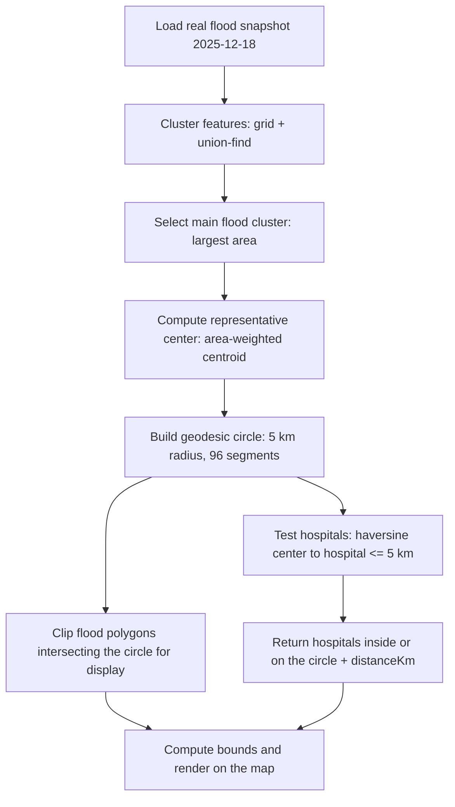

# "Hospitals within a 5 km radius of flood areas" — how it is actually computed

This document describes the **actual calculation performed by the current code on
`main`**, not a generic GIS explanation. It is written so designers, developers,
presenters and technical audiences can understand and answer the question
"how was this result computed?"

> Primary code references: `src/lib/flood-radius-analysis.ts`,
> `src/lib/flood-proximity.ts`, `src/app/api/flood-buffer/route.ts`,
> `src/sections/morphism/view/morphism-view.tsx`

---

## Purpose — what the question means

In this demo, **"hospitals within a 5 km radius of flood areas"** does **not** mean
building a morphological buffer around *every* flood-polygon edge and then finding the
hospitals that fall inside that band.

What the demo actually does is a **circular analysis-radius model**:

1. Select the **main flood cluster** from a real snapshot
2. Compute one **analysis center** representing that cluster
3. Build a **geodesic circle with a 5 km radius** around that center
4. Count only the hospitals **inside that same circle**

In other words, distance is measured from the **center of the flood cluster**, not from
the edge of each individual flood polygon. The circle drawn on the map *is* the analysis
boundary, and it is the same geometry used to filter hospitals.

> ⚠️ **Do not describe this incorrectly** as "a 5 km buffer around every flood polygon" —
> see [Difference — analysis circle vs polygon buffer](#difference--analysis-circle-vs-polygon-buffer)

---

## Input data

| Item | Actual value in the demo |
| --- | --- |
| Flood snapshot date | **18 December 2025** (`2025-12-18`) |
| Flood geometry source | Real SAR snapshot (GISTDA/Vallaris) — acquisitions `S1A_20251218_0603, S1A_20251218_1829`, stored as `detail.json.gz` (polygons / multipolygons) |
| Hospital point dataset | `public/data/hospitals.geojson` — real public hospital points (10k+ nationwide) |
| Coordinate system | Longitude/latitude (degrees, GeoJSON order `[lng, lat]`). No planar projection; distances are computed on a sphere |
| Radius | **5 kilometres** (`FLOOD_PROXIMITY_RADIUS_KM = 5`) |
| Origin of the center | Area-weighted centroid of the main flood cluster (snapped to the largest member if the centroid falls outside the cluster) |
| Server-side / preprocessing work | cluster → find center → build circle → clip flood polygons → test hospitals → compute bounds |
| Browser-side work | Render the circle, the center, the clipped flood polygons and the matching hospital points, then fit the camera to the bounds |

All of the analysis (distances, filtering) runs on the server at **`/api/flood-buffer`**,
or is precomputed into the asset `flood/2025-12-18/analysis-5km.json.gz` by the
`bun run build:flood` pipeline. The browser **never** downloads or processes the full raw
flood GeoJSON — it only receives the clipped/filtered result.

> 🔒 This document exposes no API keys, credentials or private URLs — those live in
> `.env.local` (not committed) and are accessed only through `configs/endpoint.ts`.

---

## Calculation pipeline — the real sequence

The sequence below matches `analyzeFloodRadius()` in
`src/lib/flood-radius-analysis.ts` and the rendering in `morphism-view.tsx`.

1. **Load the selected real flood dataset** — snapshot `2025-12-18` (`loadFloodDetail`)
2. **Identify the main flood cluster** — group features with a grid + union-find
   (8-neighbour at `cellKm = 2`), then select the cluster with the largest total area
   (capped at 3 circles, only for large, clearly separated clusters)
3. **Compute a representative center** — area-weighted centroid (`f_area`/`_area`, km²)
   of the cluster members, with a point-on-surface guarantee (if the centroid drifts
   outside the cluster it snaps to the center of the largest member)
4. **Build a geodesic circle with a 5 km radius** — `geodesicCircle()` walks 96 destination
   points around 0–360° using the spherical destination formula
5. **Select the flood polygons intersecting the circle** for display — keep only features
   whose minimum distance to the center is ≤ 5 km (polygons entirely outside the circle are
   dropped; the geometry inside the circle is kept unmodified)
6. **Test hospital points against the same circle** — find hospitals where
   `haversine(center, hospital) ≤ 5 km`
7. **Return only hospitals inside or on the circle's edge**, annotated with `distanceKm`
   and a `risk: true` flag
8. **Compute the result bounds and render** — a bounding box around the circle
   (⊇ every matching hospital) is used to move the camera, then the circle, center,
   clipped flood polygons and red hospital markers are drawn

### Pipeline diagram

---

## Mathematical definition

### The analysis circle

$$
C = \{\, p \mid d(p, c) \le 5\ \text{km} \,\}
$$

where
- $c$ = the analysis center
- $p$ = any geographic position
- $d$ = geodesic distance on the Earth's surface

### The geodesic distance formula the code actually uses — Haversine

`haversineKm()` uses the Haversine formula with the Earth's mean radius
$R = 6371.0088\ \text{km}$ (the `EARTH_R_KM` constant). Latitude/longitude are converted
to radians first:

$$
a = \sin^2\!\left(\frac{\Delta\varphi}{2}\right) + \cos\varphi_1 \cos\varphi_2 \sin^2\!\left(\frac{\Delta\lambda}{2}\right)
$$

$$
d = 2R \cdot \operatorname{atan2}\!\left(\sqrt{a},\ \sqrt{1 - a}\right)
$$

where $\varphi$ = latitude (radians), $\lambda$ = longitude (radians),
$\Delta\varphi = \varphi_2 - \varphi_1$, $\Delta\lambda = \lambda_2 - \lambda_1$.

The displayed circle is generated with the **spherical destination formula**
(`geodesicCircle` / `destination`), consistent with the same Haversine model — so it is a
true geodesic circle, not an ellipse on a plane.

### Hospital inclusion

A hospital $h$ is included when:

$$
d(h, c) \le 5\ \text{km}
$$

(With multiple circles, the distance to the **nearest** center is used; the returned
`distanceKm` is the Haversine distance to that nearest center.)

### Displayed flood geometry

$$
\text{DisplayedFlood} = \{\, f \in \text{FloodFeatures} \mid f \cap C \ne \varnothing \,\}
$$

A polygon $f$ counts as "intersecting the circle" when the minimum distance from the
center $c$ to the polygon (including the case where the center is inside the polygon = 0)
is $\le 5$ km.

> **Accuracy note (matches the code):** the polygon–circle test uses an
> **equirectangular** distance in `distanceToFloodGeometryKm()`
> (`KM_PER_DEG_LAT = 110.574`, `kmPerDegLon = 111.32·cos φ`), which is an approximation,
> while the displayed circle and the hospital test use **Haversine**. The divergence
> between the two methods at a 5 km scale is under ~1% (see
> [Accuracy and limitations](#accuracy-and-limitations)).

### Boundary condition

The condition uses `≤`, not `<` — both in the hospital code (`best <= radiusKm`) and for
polygons. So a hospital exactly **5.000 km** from the center **is included** in the
result (sitting on the circle's edge still counts).

---

## Difference — analysis circle vs polygon buffer

| Aspect | Current demo (circular radius) | GIS alternative (polygon buffer) |
| --- | --- | --- |
| Distance reference | **One** analysis center per cluster | **Every edge** of every flood polygon |
| Shape of the area | Geodesic circle, 5 km radius | 5 km offset band following the real flood shape |
| Hospital inclusion | $d(h, c) \le 5$ km | $d(h, \text{polygon}) \le 5$ km |
| Meaning | "Close to the **center** of the main flood area" | "Close to **any point on the water's edge**" |

**Why the demo deliberately chooses the circular model**
- Easy to communicate and read during a presentation — one circle plus one center is
  immediately understandable
- It focuses on the *selected main flood cluster*, not every patch of water nationwide
- It is stable, fast and deterministic, which suits a precomputed asset pipeline

**Why flood polygons outside the circle are hidden**
So the audience focuses on the same analysis boundary that decides the hospitals, which
reduces visual noise and keeps "what the AI sees" identical to "what was computed". Every
polygon outside the radius is filtered out server-side (in the 2025-12-18 demo, **591** of
**14,648** features remain).

---

## Worked example — from the real demo

Every value below is read from the real analysis metadata
(`public/flood-assets/flood/2025-12-18/analysis-5km.json.gz`). None of it is invented.

| Item | Value |
| --- | --- |
| Snapshot | 18 December 2025 (`2025-12-18`) |
| Acquisitions | `S1A_20251218_0603, S1A_20251218_1829` |
| Radius | 5 km |
| Selected flood cluster | 1 cluster (total area ≈ 601.52 km², 9,551 member features) |
| Analysis center | `lng 100.25063, lat 14.34462` |
| Result bounds | `[100.20422, 14.29965, 100.29704, 14.38958]` |
| Displayed flood polygons (clipped) | 591 of 14,648 features |
| **Matching hospitals** | **2** |

The hospitals found (names and distances are the real values from the metadata):

| Hospital | Distance to center |
| --- | --- |
| โรงพยาบาลส่งเสริมสุขภาพตำบลไผ่กองดิน, Suphan Buri (Phai Kong Din sub-district health promoting hospital) | 1.38 km |
| โรงพยาบาลส่งเสริมสุขภาพตำบลองครักษ์, Suphan Buri (Ongkharak sub-district health promoting hospital) | 4.52 km |

Both are ≤ 5 km, so both are included and highlighted in the system's red
(semantic error/danger) colour on the map.

---

## Accuracy and limitations

- **Geodesic vs planar** — the circle and the hospital test use Haversine (spherical,
  $R = 6371.0088$ km), while polygon clipping uses an equirectangular approximation.
  Neither is an ellipsoidal (true WGS84) distance, but at a 5 km scale the error is ≪ 1%
- **Accuracy of the center** — it is a *single* area-weighted centroid representing the
  whole cluster, so it is a representative point, not the "worst flooded point". For
  oddly shaped clusters it snaps to the largest member
- **Source data resolution** — flood polygons come from SAR image detection; their
  resolution and extent depend on image quality and upstream processing
- **Hospital position accuracy** — hospitals are points from the dataset, not real
  building footprints
- **Flood detection limits** — SAR can miss or over-detect in some areas (terrain shadow,
  vegetation cover, urban areas)
- **A snapshot is not real-time data** — it is the situation on the stated date
  (18 Dec 2025), not the current situation
- **"Near" ≠ "definitely at risk"** — the result only means *proximity within the analysis
  radius*; it does not prove that flood water reached the hospital
- **The selected cluster ≠ nationwide flooding** — only the selected main flood cluster is
  analysed (up to 3 circles), not every flooded area in the country at once

---

## Presenter FAQ

**Why is the buffer a circle?**
Because the demo measures distance from a *single analysis center* of the main flood
cluster. The set of points within ≤ 5 km of one point is, by definition, a (geodesic)
circle.

**Is the radius exactly 5 km?**
Yes — `FLOOD_PROXIMITY_RADIUS_KM = 5`, and the circle is built at exactly 5.000 km. The
condition is `≤`, so a hospital exactly 5 km away is still counted.

**Are hospitals inside a flood polygon counted too?**
Yes, if their distance to the *center* is ≤ 5 km. The criterion is distance to the center,
not containment in a polygon (a hospital inside a flooded area but more than 5 km from the
center is not counted).

**Why hide the flood polygons outside the circle?**
To focus on the analysis boundary and keep the picture identical to what was computed.
Polygons outside the radius are filtered out server-side; the geometry inside the circle is
real and unmodified.

**Is this computed in the browser?**
No. The analysis runs server-side (`/api/flood-buffer`) or is precomputed. The browser only
receives the result (circle, center, clipped flood, hospitals) and renders it.

**Does the result prove the hospitals were flooded?**
No. It only indicates *proximity within a 5 km radius* of the flood cluster's center — it is
not a confirmation that water reached them.

**Can the radius be changed?**
Technically yes — adjust `FLOOD_PROXIMITY_RADIUS_KM` (and the `radiusKm` option) and rebuild
the asset. The current demo is fixed at 5 km.

**Can several flood clusters be analysed?**
Yes. The model supports up to 3 circles (`maxCircles`) for large, clearly separated
clusters, and hospitals are tested against the *union of the circles*. In the 2025-12-18
demo only 1 cluster qualified.

---

## Doc ↔ code consistency note

Verified against the code as of writing. The one detail worth stating explicitly (not a bug,
just an implementation detail): **the circle and the hospital test use Haversine, while
flood-polygon clipping uses an equirectangular approximation.** Different methods, but the
difference at a 5 km scale is not significant. If 100% consistency is wanted later,
`distanceToFloodGeometryKm` can be switched to Haversine without affecting the hospital
results or the count of 2.
